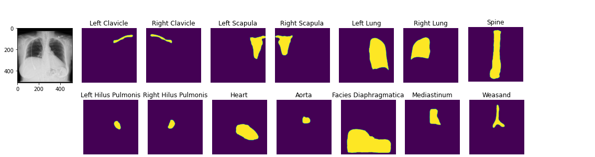

🚨 Paper now online! [https://arxiv.org/abs/2111.00595](https://arxiv.org/abs/2111.00595)

🚨 Documentation now online! [https://mlmed.org/torchxrayvision/](https://mlmed.org/torchxrayvision/)

# TorchXRayVision 

|   |  ([🎬 promo video](https://www.youtube.com/watch?v=Rl7xz0uULGQ)) <br>[)](http://www.youtube.com/watch?v=Rl7xz0uULGQ "Video Title") |
|---|---|

# What is it?

A library for chest X-ray datasets and models. Including pre-trained models.


TorchXRayVision is an open source software library for working with chest X-ray datasets and deep learning models. It provides a common interface and common pre-processing chain for a wide set of publicly available chest X-ray datasets. In addition, a number of classification and representation learning models with different architectures, trained on different data combinations, are available through the library to serve as baselines or feature extractors.

- In the case of researchers addressing clinical questions it is a waste of time for them to train models from scratch. To address this, TorchXRayVision provides pre-trained models which are trained on large cohorts of data and enables 1) rapid analysis of large datasets 2) feature reuse for few-shot learning.
- In the case of researchers developing algorithms it is important to robustly evaluate models using multiple external datasets. Metadata associated with each dataset can vary greatly which makes it difficult to apply methods to multiple datasets. TorchXRayVision provides access to many datasets in a uniform way so that they can be swapped out with a single line of code. These datasets can also be merged and filtered to construct specific distributional shifts for studying generalization.

Twitter: [@torchxrayvision](https://twitter.com/torchxrayvision)

## Getting started

```
$ pip install torchxrayvision
```

```python3
import torchxrayvision as xrv
import skimage, torch, torchvision

# Prepare the image:
img = skimage.io.imread("16747_3_1.jpg")
img = xrv.datasets.normalize(img, 255) # convert 8-bit image to [-1024, 1024] range
img = img.mean(2)[None, ...] # Make single color channel

transform = torchvision.transforms.Compose([xrv.datasets.XRayCenterCrop(),xrv.datasets.XRayResizer(224)])

img = transform(img)
img = torch.from_numpy(img)

# Load model and process image
model = xrv.models.DenseNet(weights="densenet121-res224-all")
outputs = model(img[None,...]) # or model.features(img[None,...]) 

# Print results
dict(zip(model.pathologies,outputs[0].detach().numpy()))

{'Atelectasis': 0.32797316,
 'Consolidation': 0.42933336,
 'Infiltration': 0.5316924,
 'Pneumothorax': 0.28849724,
 'Edema': 0.024142697,
 'Emphysema': 0.5011832,
 'Fibrosis': 0.51887786,
 'Effusion': 0.27805611,
 'Pneumonia': 0.18569896,
 'Pleural_Thickening': 0.24489835,
 'Cardiomegaly': 0.3645515,
 'Nodule': 0.68982,
 'Mass': 0.6392845,
 'Hernia': 0.00993878,
 'Lung Lesion': 0.011150705,
 'Fracture': 0.51916164,
 'Lung Opacity': 0.59073937,
 'Enlarged Cardiomediastinum': 0.27218717}

```

A sample script to process images usings pretrained models is [process_image.py](https://github.com/mlmed/torchxrayvision/blob/master/scripts/process_image.py)

```
$ python3 process_image.py ../tests/00000001_000.png
{'preds': {'Atelectasis': 0.50500506,
           'Cardiomegaly': 0.6600903,
           'Consolidation': 0.30575264,
           'Edema': 0.274184,
           'Effusion': 0.4026162,
           'Emphysema': 0.5036339,
           'Enlarged Cardiomediastinum': 0.40989172,
           'Fibrosis': 0.53293407,
           'Fracture': 0.32376793,
           'Hernia': 0.011924741,
           'Infiltration': 0.5154413,
           'Lung Lesion': 0.22231922,
           'Lung Opacity': 0.2772148,
           'Mass': 0.32237658,
           'Nodule': 0.5091847,
           'Pleural_Thickening': 0.5102617,
           'Pneumonia': 0.30947986,
           'Pneumothorax': 0.24847917}}

```

## Models ([demo notebook](https://github.com/mlmed/torchxrayvision/blob/master/scripts/xray_models.ipynb))

Specify weights for pretrained models (currently all DenseNet121)
Note: Each pretrained model has 18 outputs. The `all` model has every output trained. However, for the other weights some targets are not trained and will predict randomly becuase they do not exist in the training dataset. The only valid outputs are listed in the field `{dataset}.pathologies` on the dataset that corresponds to the weights. 

```python3

## 224x224 models
model = xrv.models.DenseNet(weights="densenet121-res224-all")
model = xrv.models.DenseNet(weights="densenet121-res224-rsna") # RSNA Pneumonia Challenge
model = xrv.models.DenseNet(weights="densenet121-res224-nih") # NIH chest X-ray8
model = xrv.models.DenseNet(weights="densenet121-res224-pc") # PadChest (University of Alicante)
model = xrv.models.DenseNet(weights="densenet121-res224-chex") # CheXpert (Stanford)
model = xrv.models.DenseNet(weights="densenet121-res224-mimic_nb") # MIMIC-CXR (MIT)
model = xrv.models.DenseNet(weights="densenet121-res224-mimic_ch") # MIMIC-CXR (MIT)

# 512x512 models
model = xrv.models.ResNet(weights="resnet50-res512-all")

# DenseNet121 from JF Healthcare for the CheXpert competition
model = xrv.baseline_models.jfhealthcare.DenseNet() 

# Official Stanford CheXpert model
model = xrv.baseline_models.chexpert.DenseNet(weights_zip="chexpert_weights.zip")

# Emory HITI lab race prediction model
model = xrv.baseline_models.emory_hiti.RaceModel()
model.targets -> ["Asian", "Black", "White"]

# Riken age prediction model
model = xrv.baseline_models.riken.AgeModel()

```

Benchmarks of the modes are here: [BENCHMARKS.md](BENCHMARKS.md) and the performance of some of the models can be seen in this paper [arxiv.org/abs/2002.02497](https://arxiv.org/abs/2002.02497). 


## Autoencoders 
You can also load a pre-trained autoencoder that is trained on the PadChest, NIH, CheXpert, and MIMIC datasets.
```python3
ae = xrv.autoencoders.ResNetAE(weights="101-elastic")
z = ae.encode(image)
image2 = ae.decode(z)
```

## Segmentation

You can load pretrained anatomical segmentation models. [Demo Notebook](scripts/segmentation.ipynb)

```python3
seg_model = xrv.baseline_models.chestx_det.PSPNet()
output = seg_model(image)
output.shape # [1, 14, 512, 512]
seg_model.targets # ['Left Clavicle', 'Right Clavicle', 'Left Scapula', 'Right Scapula',
                  #  'Left Lung', 'Right Lung', 'Left Hilus Pulmonis', 'Right Hilus Pulmonis',
                  #  'Heart', 'Aorta', 'Facies Diaphragmatica', 'Mediastinum',  'Weasand', 'Spine']
```



## Datasets 
[View docstrings for more detail on each dataset](https://github.com/mlmed/torchxrayvision/blob/master/torchxrayvision/datasets.py) and [Demo notebook](https://github.com/mlmed/torchxrayvision/blob/master/scripts/xray_datasets.ipynb) and [Example loading script](https://github.com/mlmed/torchxrayvision/blob/master/scripts/dataset_utils.py)

```python3
transform = torchvision.transforms.Compose([xrv.datasets.XRayCenterCrop(),
                                            xrv.datasets.XRayResizer(224)])

# RSNA Pneumonia Detection Challenge. https://pubs.rsna.org/doi/full/10.1148/ryai.2019180041
d_kaggle = xrv.datasets.RSNA_Pneumonia_Dataset(imgpath="path to stage_2_train_images_jpg",
                                       transform=transform)
                
# CheXpert: A Large Chest Radiograph Dataset with Uncertainty Labels and Expert Comparison. https://arxiv.org/abs/1901.07031             
d_chex = xrv.datasets.CheX_Dataset(imgpath="path to CheXpert-v1.0-small",
                                   csvpath="path to CheXpert-v1.0-small/train.csv",
                                   transform=transform)

# National Institutes of Health ChestX-ray8 dataset. https://arxiv.org/abs/1705.02315
d_nih = xrv.datasets.NIH_Dataset(imgpath="path to NIH images")

# A relabelling of a subset of NIH images from: https://pubs.rsna.org/doi/10.1148/radiol.2019191293
d_nih2 = xrv.datasets.NIH_Google_Dataset(imgpath="path to NIH images")

# PadChest: A large chest x-ray image dataset with multi-label annotated reports. https://arxiv.org/abs/1901.07441
d_pc = xrv.datasets.PC_Dataset(imgpath="path to image folder")

# COVID-19 Image Data Collection. https://arxiv.org/abs/2006.11988
d_covid19 = xrv.datasets.COVID19_Dataset() # specify imgpath and csvpath for the dataset

# SIIM Pneumothorax Dataset. https://www.kaggle.com/c/siim-acr-pneumothorax-segmentation
d_siim = xrv.datasets.SIIM_Pneumothorax_Dataset(imgpath="dicom-images-train/",
                                                csvpath="train-rle.csv")

# VinDr-CXR: An open dataset of chest X-rays with radiologist's annotations. https://arxiv.org/abs/2012.15029
d_vin = xrv.datasets.VinBrain_Dataset(imgpath=".../train",
                                      csvpath=".../train.csv")

# National Library of Medicine Tuberculosis Datasets. https://www.ncbi.nlm.nih.gov/pmc/articles/PMC4256233/
d_nlmtb = xrv.datasets.NLMTB_Dataset(imgpath="path to MontgomerySet or ChinaSet_AllFiles")
```

## Dataset fields

Each dataset contains a number of fields. These fields are maintained when xrv.datasets.Subset_Dataset and xrv.datasets.Merge_Dataset are used.

 - `.pathologies` This field is a list of the pathologies contained in this dataset that will be contained in the `.labels` field ].

 - `.labels` This field contains a 1,0, or NaN for each label defined in `.pathologies`. 

 - `.csv` This field is a pandas DataFrame of the metadata csv file that comes with the data. Each row aligns with the elements of the dataset so indexing using `.iloc` will work. 

If possible, each dataset's `.csv` will have some common fields of the csv. These will be aligned when The list is as follows:

- `csv.patientid` A unique id that will uniqely identify samples in this dataset

- `csv.offset_day_int` An integer time offset for the image in the unit of days. This is expected to be for relative times and has no absolute meaning although for some datasets it is the epoch time.

- `csv.age_years` The age of the patient in years.

- `csv.sex_male` If the patient is male

- `csv.sex_female` If the patient is female


## Dataset tools

relabel_dataset will align labels to have the same order as the pathologies argument.
```python3
xrv.datasets.relabel_dataset(xrv.datasets.default_pathologies , d_nih) # has side effects
```

specify a subset of views ([demo notebook](https://github.com/mlmed/torchxrayvision/blob/master/scripts/xray_datasets_views.ipynb))
```python3
d_kaggle = xrv.datasets.RSNA_Pneumonia_Dataset(imgpath="...",
                                               views=["PA","AP","AP Supine"])
```

specify only 1 image per patient
```python3
d_kaggle = xrv.datasets.RSNA_Pneumonia_Dataset(imgpath="...",
                                               unique_patients=True)
```

obtain summary statistics per dataset
```python3
d_chex = xrv.datasets.CheX_Dataset(imgpath="CheXpert-v1.0-small",
                                   csvpath="CheXpert-v1.0-small/train.csv",
                                 views=["PA","AP"], unique_patients=False)

CheX_Dataset num_samples=191010 views=['PA', 'AP']
{'Atelectasis': {0.0: 17621, 1.0: 29718},
 'Cardiomegaly': {0.0: 22645, 1.0: 23384},
 'Consolidation': {0.0: 30463, 1.0: 12982},
 'Edema': {0.0: 29449, 1.0: 49674},
 'Effusion': {0.0: 34376, 1.0: 76894},
 'Enlarged Cardiomediastinum': {0.0: 26527, 1.0: 9186},
 'Fracture': {0.0: 18111, 1.0: 7434},
 'Lung Lesion': {0.0: 17523, 1.0: 7040},
 'Lung Opacity': {0.0: 20165, 1.0: 94207},
 'Pleural Other': {0.0: 17166, 1.0: 2503},
 'Pneumonia': {0.0: 18105, 1.0: 4674},
 'Pneumothorax': {0.0: 54165, 1.0: 17693},
 'Support Devices': {0.0: 21757, 1.0: 99747}}
```

## Pathology masks ([demo notebook](https://github.com/mlmed/torchxrayvision/blob/master/scripts/xray_masks.ipynb))

Masks are available in the following datasets:
```python3
xrv.datasets.RSNA_Pneumonia_Dataset() # for Lung Opacity
xrv.datasets.SIIM_Pneumothorax_Dataset() # for Pneumothorax
xrv.datasets.NIH_Dataset() # for Cardiomegaly, Mass, Effusion, ...
```

Example usage:

```python3
d_rsna = xrv.datasets.RSNA_Pneumonia_Dataset(imgpath="stage_2_train_images_jpg", 
                                            views=["PA","AP"],
                                            pathology_masks=True)
                                            
# The has_masks column will let you know if any masks exist for that sample
d_rsna.csv.has_masks.value_counts()
False    20672
True      6012       

# Each sample will have a pathology_masks dictionary where the index 
# of each pathology will correspond to a mask of that pathology (if it exists).
# There may be more than one mask per sample. But only one per pathology.
sample["pathology_masks"][d_rsna.pathologies.index("Lung Opacity")]
```


it also works with data_augmentation if you pass in `data_aug=data_transforms` to the dataloader. The random seed is matched to align calls for the image and the mask.


## Distribution shift tools ([demo notebook](https://github.com/mlmed/torchxrayvision/blob/master/scripts/xray_datasets-CovariateShift.ipynb))

The class `xrv.datasets.CovariateDataset` takes two datasets and two 
arrays representing the labels. The samples will be returned with the 
desired ratio of images from each site. The goal here is to simulate 
a covariate shift to make a model focus on an incorrect feature. Then 
the shift can be reversed in the validation data causing a catastrophic
failure in generalization performance.

ratio=0.0 means images from d1 will have a positive label
ratio=0.5 means images from d1 will have half of the positive labels
ratio=1.0 means images from d1 will have no positive label

With any ratio the number of samples returned will be the same.

```python3
d = xrv.datasets.CovariateDataset(d1 = # dataset1 with a specific condition
                                  d1_target = #target label to predict,
                                  d2 = # dataset2 with a specific condition
                                  d2_target = #target label to predict,
                                  mode="train", # train, valid, and test
                                  ratio=0.9)

```

## Citation

Primary TorchXRayVision paper: [https://arxiv.org/abs/2111.00595](https://arxiv.org/abs/2111.00595)

```
Joseph Paul Cohen, Joseph D. Viviano, Paul Bertin, Paul Morrison, Parsa Torabian, Matteo Guarrera, Matthew P Lungren, Akshay Chaudhari, Rupert Brooks, Mohammad Hashir, Hadrien Bertrand
TorchXRayVision: A library of chest X-ray datasets and models. 
Medical Imaging with Deep Learning
https://github.com/mlmed/torchxrayvision, 2020


@inproceedings{Cohen2022xrv,
title = {{TorchXRayVision: A library of chest X-ray datasets and models}},
author = {Cohen, Joseph Paul and Viviano, Joseph D. and Bertin, Paul and Morrison, Paul and Torabian, Parsa and Guarrera, Matteo and Lungren, Matthew P and Chaudhari, Akshay and Brooks, Rupert and Hashir, Mohammad and Bertrand, Hadrien},
booktitle = {Medical Imaging with Deep Learning},
url = {https://github.com/mlmed/torchxrayvision},
arxivId = {2111.00595},
year = {2022}
}

```
and this paper which initiated development of the library: [https://arxiv.org/abs/2002.02497](https://arxiv.org/abs/2002.02497)
```
Joseph Paul Cohen and Mohammad Hashir and Rupert Brooks and Hadrien Bertrand
On the limits of cross-domain generalization in automated X-ray prediction. 
Medical Imaging with Deep Learning 2020 (Online: https://arxiv.org/abs/2002.02497)

@inproceedings{cohen2020limits,
  title={On the limits of cross-domain generalization in automated X-ray prediction},
  author={Cohen, Joseph Paul and Hashir, Mohammad and Brooks, Rupert and Bertrand, Hadrien},
  booktitle={Medical Imaging with Deep Learning},
  year={2020},
  url={https://arxiv.org/abs/2002.02497}
}
```

## Supporters/Sponsors


| <a href="https://cifar.ca/"></a><br> CIFAR (Canadian Institute for Advanced Research)  |  <a href="https://mila.quebec/"></a><br> Mila, Quebec AI Institute, University of Montreal |
|:---:|:---:|
| <a href="http://aimi.stanford.edu/"></a> <br><b>Stanford University's Center for <br>Artificial Intelligence in Medicine & Imaging</b>  | <a href="http://www.carestream.com/"></a> <br><b>Carestream Health</b>  |


